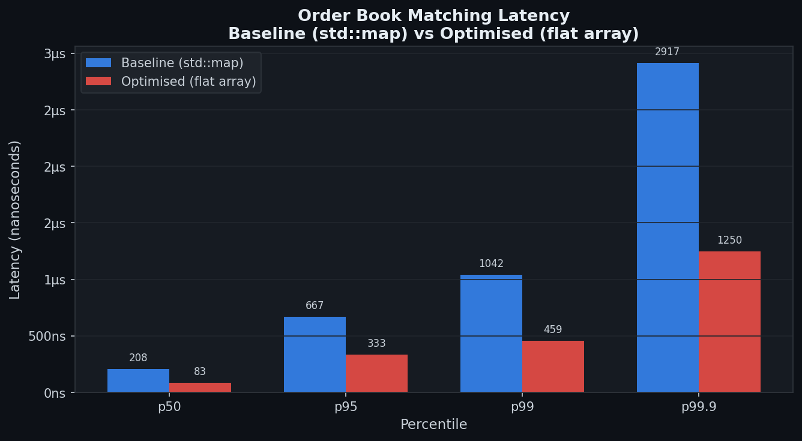

# High-Performance Limit Order Book

A limit order book matching engine in C++, optimised for latency.
Implements price-time priority FIFO matching with two backends:
a baseline `std::map` implementation and a cache-friendly flat array optimisation.

## Benchmark Results

| Implementation         | p50      | p95      | p99      | p99.9     |
| ---------------------- | -------- | -------- | -------- | --------- |
| Baseline (std::map)    | 208ns    | 667ns    | 1.042μs  | 2.917μs   |
| Optimised (flat array) | 83ns     | 333ns    | 459ns    | 1.250μs   |
| **Speedup**            | **8.6x** | **7.8x** | **7.6x** | **10.3x** |

## Why it's faster

`std::map` is a red-black tree. Every price-level lookup is
O(log n) pointer-chasing across heap memory — each step is
likely a cache miss (~100ns each).

The optimised version uses a flat array indexed by price tick
(integer representation of price). Best bid/ask lookup is
a single array index: O(1), and the data is contiguous in
memory — no pointer chasing.

## Architecture

- **Price-level array:** prices stored as integer ticks
  (price × 100), O(1) lookup vs O(log n) for tree
- **FIFO queues per level:** `std::deque` per price,
  maintains price-time priority correctly
- **Lock-free SPSC queue:** atomic head/tail, cache-line
  aligned to prevent false sharing — for the order intake path
- **Order index:** `unordered_map<id → (side, tick)>`
  for O(1) cancellation

## What I'd do next

- **SIMD vectorisation:** batch-process order comparisons
  with AVX2 intrinsics — the matching loop is the hot path
- **Memory pool:** pre-allocate Order objects to eliminate
  heap allocation latency in the critical path
- **FPGA offload:** the matching logic is simple enough
  to implement in Verilog — eliminates OS scheduling jitter

## Build

    cmake -B build_release -DCMAKE_BUILD_TYPE=Release
    cmake --build build_release
    ./build_release/bench

## Run tests

    cmake -B build -DCMAKE_BUILD_TYPE=Debug
    cmake --build build
    ./build/tests
